# petshelter

Verslag projectwerk programmeren

CVO Panta Rhei

2019 Semester 2

Mathijs Deprez

## Inhoudstafel

- [petshelter](#petshelter)
  - [Inhoudstafel](#inhoudstafel)
  - [petshelter opstarten](#petshelter-opstarten)
    - [Client: via NPM](#client-via-npm)
    - [API: via dotnet console API](#api-via-dotnet-console-api)
  - [Functionele analyse](#functionele-analyse)
    - [Probleembeschrijving](#probleembeschrijving)
    - [Use Cases](#use-cases)
      - [Overzicht](#overzicht)
      - [Client Authenticatie](#client-authenticatie)
      - [Overzicht huisdieren](#overzicht-huisdieren)
      - [Afspraak maken](#afspraak-maken)
      - [Afspraken bekijken](#afspraken-bekijken)
      - [Vrijwilliger huisdieren creëren](#vrijwilliger-huisdieren-cre%C3%ABren)
      - [Admin overzicht users](#admin-overzicht-users)
    - [Entity Relation Diagram](#entity-relation-diagram)
  - [Technische analyse](#technische-analyse)
    - [Globaal](#globaal)
    - [ASP.NET Core](#aspnet-core)
      - [Standaard](#standaard)
      - [Configuratie](#configuratie)
      - [AutoMapper](#automapper)
      - [MediatR, CQRS en features: een voorbeeld met feature "Maak afspraak"](#mediatr-cqrs-en-features-een-voorbeeld-met-feature-%22maak-afspraak%22)
      - [Asynchroon](#asynchroon)
        - [Background tasks met ASP Hosted Services](#background-tasks-met-asp-hosted-services)
      - [HttpClient](#httpclient)
      - [Mailgun, MimeKit & ICal.NET](#mailgun-mimekit--icalnet)
      - [Images uploaden en opslaan in SQL Server](#images-uploaden-en-opslaan-in-sql-server)
    - [Client: Vue, Vue plugins en andere NPM pakketten](#client-vue-vue-plugins-en-andere-npm-pakketten)
      - [Wat is Vue](#wat-is-vue)
      - [Waarom Vue (of gelijk welk modern JavaScript framework)](#waarom-vue-of-gelijk-welk-modern-javascript-framework)
        - [De HTML Document Object Model](#de-html-document-object-model)
      - [Hoe werkt Vue](#hoe-werkt-vue)
        - [Installeren](#installeren)
    - [Authenticatie en autorisatie](#authenticatie-en-autorisatie)
      - [Voeg claims (en dus rollen) toe aan tokens](#voeg-claims-en-dus-rollen-toe-aan-tokens)
      - [Client configuratie](#client-configuratie)
      - [API configuratie](#api-configuratie)
        - [Resource based authorization](#resource-based-authorization)
    - [Tools](#tools)
  - [Bronnen](#bronnen)
    - [Vue & Frontend](#vue--frontend)
    - [ASP.NET](#aspnet)
    - [CQRS](#cqrs)
    - [Threads](#threads)
    - [Mails](#mails)
    - [Images](#images)
    - [Authenticatie](#authenticatie)
    - [Tools](#tools-1)

## petshelter opstarten

### Client: via NPM

[Installeer Node.js en NPM](https://www.npmjs.com/get-npm)

Installeer vue

``` sh
npm install vue
```

Installeer vue cli/ui

``` sh
npm install -g @vue/cli
```

Navigeer naar het petshelterClient project (folder waar ```package.json``` in staat)

``` sh
cd C:\pad\naar\petshelterClient
```

Voer volgend command uit:

``` sh
npm run serve
```

Na de client gebouwd is zou er een boodschap moeten verschijnen dat petshelterClient aan het draaien is op poort 8080. Navigeer via Chrome naar http://localhost:8080.

### API: via dotnet console API

**Pas op: de ```appsettings.development.json``` bevat API keys voor o.a. Mailgun. Deze blijven dus beter privaat! In die file kan men ook de TestMail parameter aanpassen.**

[De API kan gebouwd worden via de dotnet CLI.](https://docs.microsoft.com/en-us/dotnet/core/tools/dotnet-run?tabs=netcore21) Indien Visual Studio met .NET Core geïnstalleerd is, is ook de CLI geïnstalleerd. Of bouw het project via Visual Studio zelf. Anders kan met [deze installatiefiles](https://dotnet.microsoft.com/download/dotnet-core/2.2) .NET Core (x64) geïnstalleerd worden.

Navigeer naar het petshelterClient project (folder waar ```csproj``` file in staat)

``` sh
cd C:\pad\naar\petshelterApi
```

Voer volgend command uit:

``` sh
dotnet run
```

Volgens de launchsettings.json zou de API moeten draaien op https://localhost:44385/. Test de API via de publieke call https://localhost:44385/api/pets.

## Functionele analyse

### Probleembeschrijving

Een VZW voor dierenbelangen wil graag een platform aanbieden om lokale dierenasielen te ondersteunen bij het adoptieproces. De huidige situatie is vaak dat centra niet beschikken over een digitaal medium. Als er wel een digitale aanwezigheid is, volstaat het soms niet: statische websites of mailinglists. Een ander voordeel van het voorstel is het samenvoegen van data: een bezoeker kan, indien de user en het asiel dat wenst, van elk samenwerkend asiel gegevens bekijken, zonder geografische beperkingen.

Het platform moet het immers mogelijk maken om verschillende asielen (shelters) te organiseren, die zelfstandig gemanaged kunnen worden. Elk shelter kan hun eigen huisdierenbestand beheren. Dit huisdierenbestand wordt online ter adoptie aangeboden.

Registratie is niet nodig om een overzicht te verkrijgen van de huisdieren. Maar na registratie kan een bezoeker een afspraak maken om een huisdier te bezoeken en eventueel te adopteren. De input en validatie van de afspraakform moet vlot verlopen. Het is belangrijk dat er geen dubbele afspraken gemaakt worden, zowel de afspraken van user, huisdier en shelters in rekening houdende. Afspraken moeten altijd een halfuur tussen elkaar liggen. Bij het maken van een afspraak wordt een mail verzonden worden naar de user. Bij de mail is er een afspraakcomponent die met alle populaire mailagenda's samenwerkt (Gmail, Outlook, Apple,...).

Een user met admin rol kan een overzicht verkrijgen over alle petshelter users en login informatie. Een admin kan ook een shelter toewijzen aan een user met volunteer rol. Overige zaken kunnen ook via een extern authenticatie dashboard geconfigureerd worden.

Een user met volunteer rol kan een nieuw huisdier maken. Het huisdier moet gekoppeld zijn aan de shelter van de volunteer. Naast enkele andere verplichte informatie moet de volunteer ook een foto opladen. Deze foto is daarna zichtbaar in het overzicht.

De hele applicatie moet responsief zijn en er degelijk uitzien.

### Use Cases

#### Overzicht

**Actor**|**Use case**|**Actor**
:-----:|:-----:|:-----:
Client|Authenticatie/Autorisatie|Auth0
User|Overzicht huisdieren|SQL Server
User|Afspraak maken|SQL Server
Webservice|Afspraakmail|Mailgun
User|Afspraken bekijken|SQL Server
User|Afspraak annuleren|SQL Server
Vrijwilliger|Huisdier creëren|SQL Server
Vrijwilliger|Foto uploaden|SQL Server
Admin|Overzicht users|Auth0 Management API
Admin|User updaten|Auth0 Management API

#### Client Authenticatie

Het is mogelijk zelf een login pagina te maken, maar Auth0 voorziet een Universal Login page die kan gebruikt worden om in te loggen, of een nieuw account te maken.

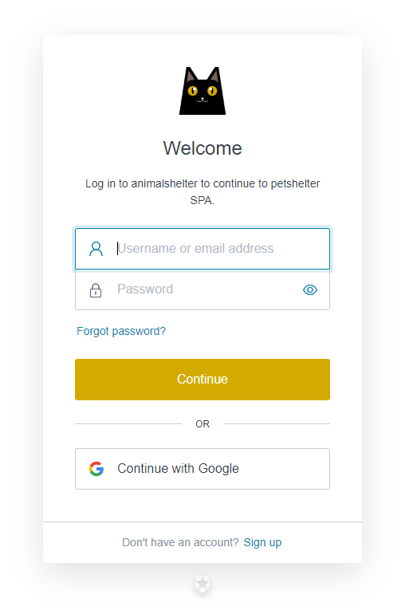

</br>

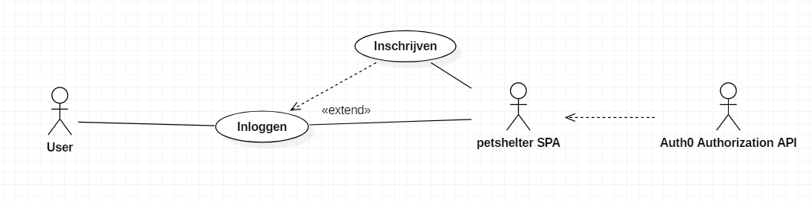

Voor het profielkaartje wordt de ```userId``` uit de JSON Web Token User ID gebruikt (meer bij technische analyse).

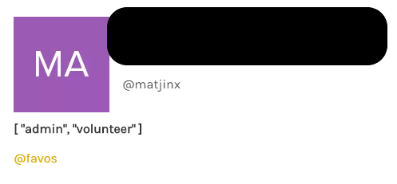

#### Overzicht huisdieren

Na het opgeven van een zoekopdracht ziet de user een overzicht van huisdieren.

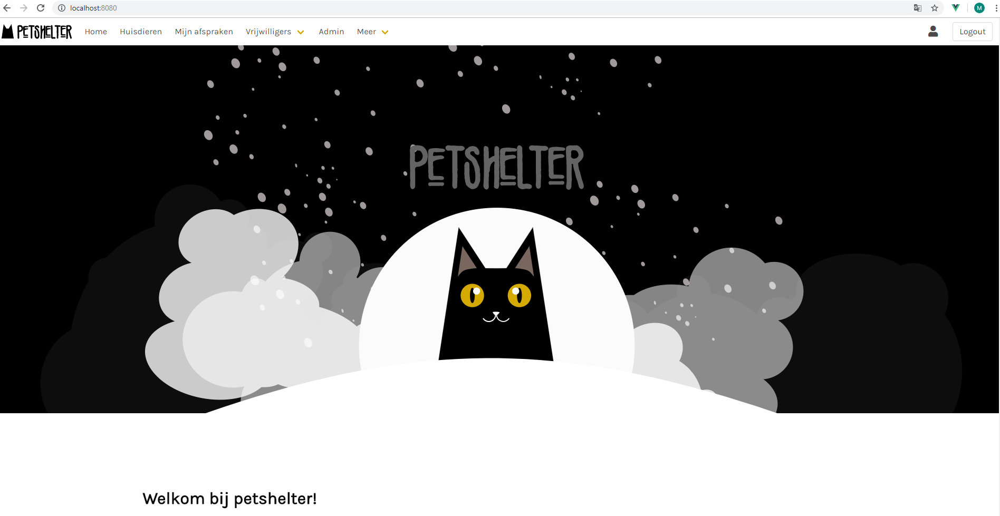

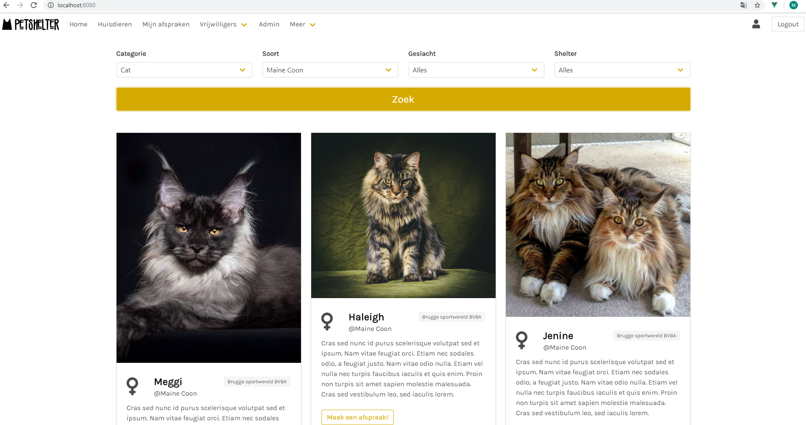

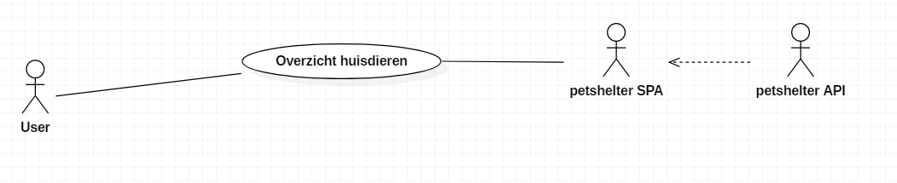

#### Afspraak maken

Na het maken van een afspraak wordt er altijd een mail gezonden.

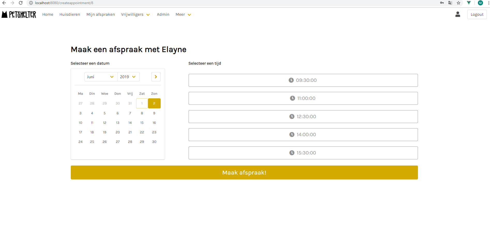

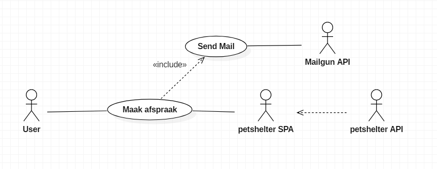

#### Afspraken bekijken

In dezelfde pagina kan men ook een afspraak annuleren.

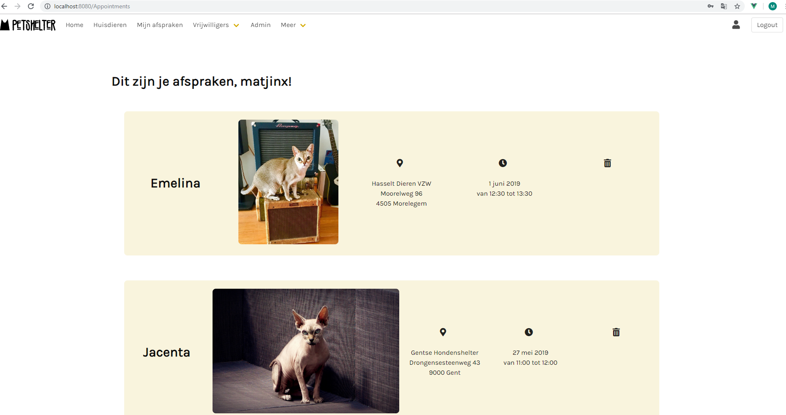

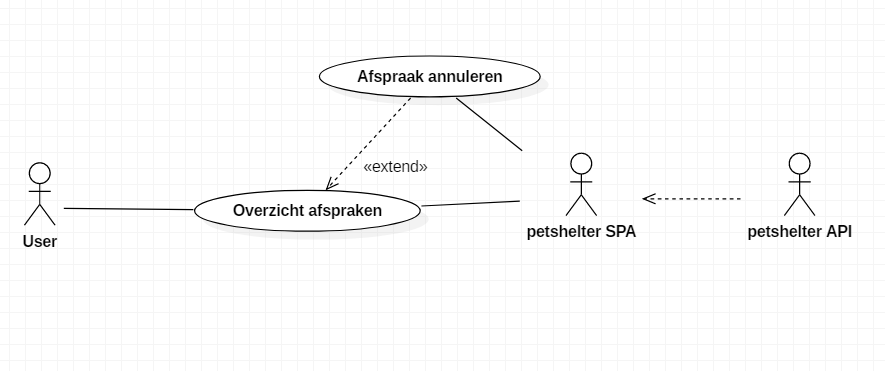

#### Vrijwilliger huisdieren creëren

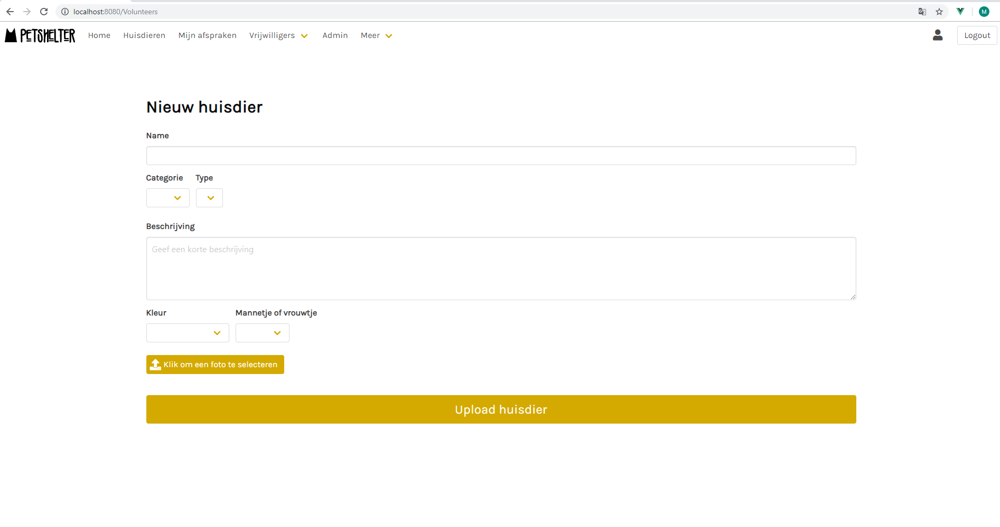

Een vrijwilliger is verplicht een foto te posten.

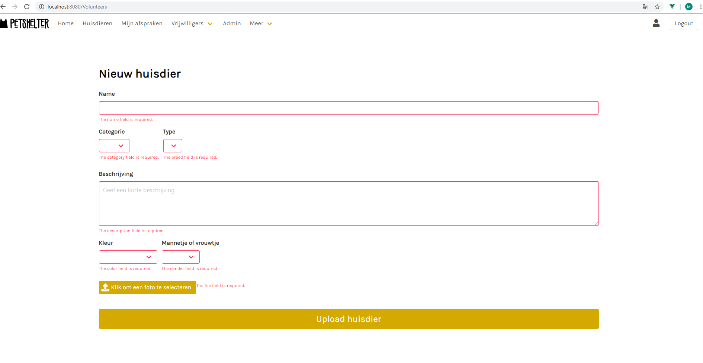

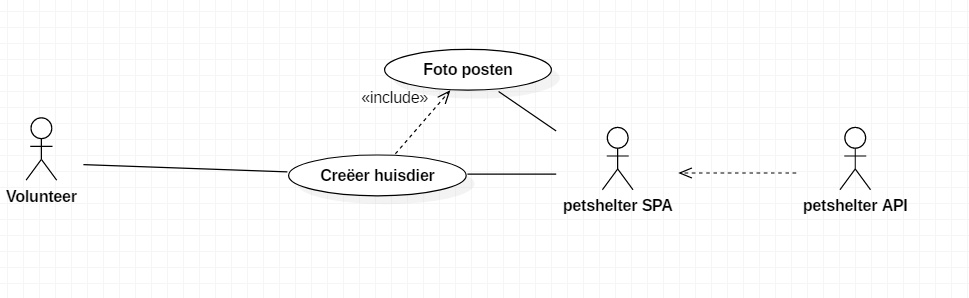

#### Admin overzicht users

Als de admin op een user klikt in de tabel, kan hij de shelter van die user aanpassen of verwijderen.

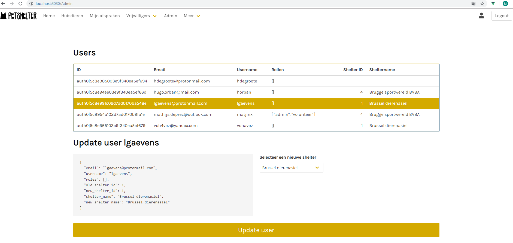

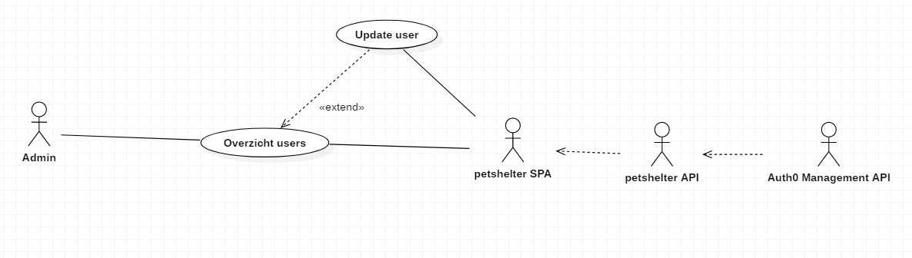

### Entity Relation Diagram

Voor data op te slaan gebruikt petshelter API Microsoft SQL Server, met volgend ERD:

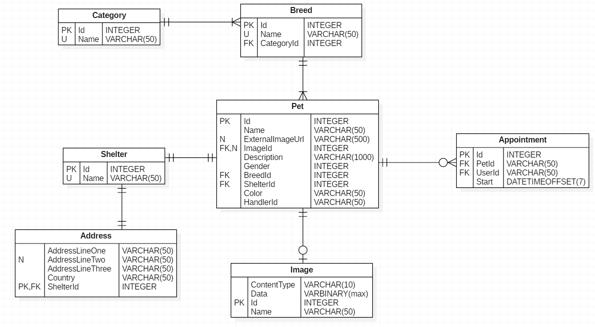

Deze properties zijn te krijgen van de Auth0 userstore:

```json
{
    "email_verified": true,
    "email": "",
    "username": "matjinx",
    "updated_at": "2019-06-01T19:39:40.744Z",
    "user_id": "auth0|5c8954a102d7ad0170b9fa1e",
    "name": "",
    "picture": "https://s.gravatar.com/avatar/afa2ca5770138190dece720aef7f796e?s=480&r=pg&d=https%3A%2F%2Fcdn.auth0.com%2Favatars%2Fma.png",
    "nickname": "matjinx",
    "identities": [
        {
            "connection": "Username-Password-Authentication",
            "provider": "auth0",
            "user_id": "5c8954a102d7ad0170b9fa1e",
            "isSocial": false
        }
    ],
    "created_at": "2019-03-13T19:06:09.292Z",
    "user_metadata": {},
    "app_metadata": {
        "shelter": "4",
        "roles": [
            "admin",
            "volunteer"
        ]
    },
    "last_ip": "78.23.195.50",
    "last_login": "2019-05-31T11:33:05.561Z",
    "logins_count": 79,
    "blocked_for": [],
    "guardian_authenticators": []
}
```

## Technische analyse

### Globaal

petshelter is een applicatie die bestaat uit twee projecten: petshelterAPI & petshelterClient. Hieronder een kort overzicht van de technologiestack.

petshelterApi is een webservice geschreven in ASP.NET Core 2.2. De API heeft wat REST elementen, maar het kan zeker geen RESTful API genoemd worden. Het is de bedoeling dat de API enkel ingezet wordt als data access voor één frontend, en daarom is volledig RESTful werken overbodig.

petshelterClient vormt de brug tussen de user en API via een Vue frontend. Vue is een JavaScript framework. Er worden enkele externe componenten gebruikt zoals Buefy, vue-router, axios, etc... Het zwakke punt aan de client is dat er niet echt een design pattern wordt toegepast. Voor een proof of concept werd dit eerst als redundant beschouwd, maar na enkele componenten te schrijven werd duidelijk dat er veel code herhaald wordt. Een store-pattern (dus: ```vuex``` implementatie) en enkele services zou de client code meer onderhoudbaar en scalable maken.

Authenticatie en autorisatie worden zowel front- als backend geïmplementeerd. De identity provider is Auth0 of Google. Auth0 voorziet ook tools om alles omtrent authenticatie te configureren. Maar sommige stukjes zijn ook configureerbaar via code in de API. In petshelter wordt dit toegepast dat via een implementatie van de ```HttpClient``` klasse, die toegang geeft tot de Auth0 userstore.

Dit is een diagram van de technologiestack. Nieuwe technologieën hebben een grijze achtergrond.

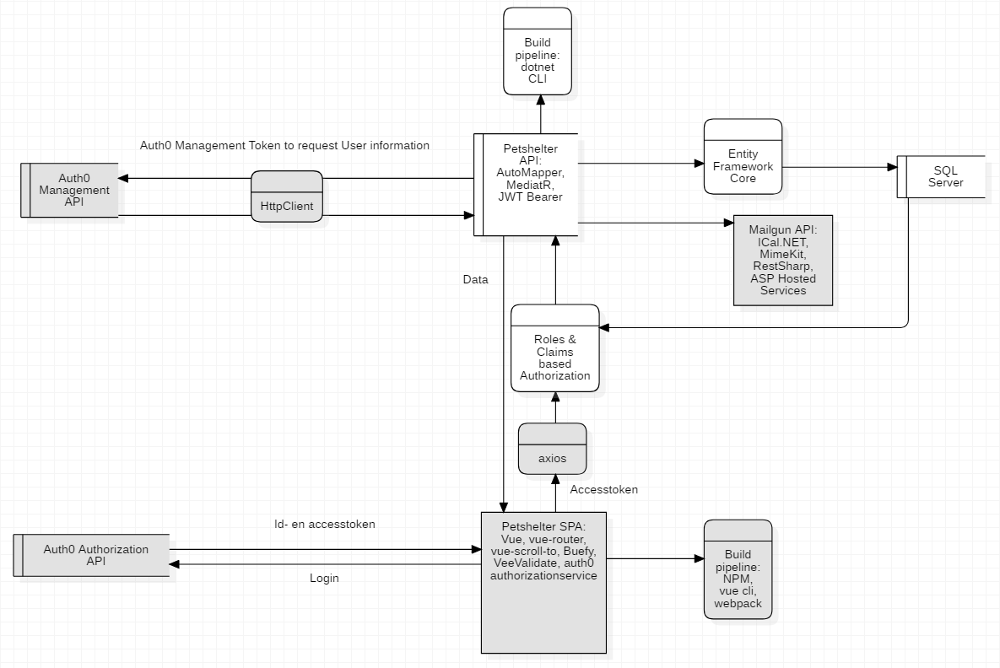

### ASP.NET Core

#### Standaard

* [MVC](https://docs.microsoft.com/en-us/aspnet/core/tutorials/first-mvc-app/?view=aspnetcore-2.2)
* [Dependency Injection](https://docs.microsoft.com/en-us/aspnet/core/fundamentals/dependency-injection?view=aspnetcore-2.2)
* [EF Core: algemeen](https://docs.microsoft.com/en-us/ef/core/)
* [EF Core: deferred execution](https://docs.microsoft.com/en-us/dotnet/framework/data/adonet/ef/language-reference/query-execution)
* [Roles](https://docs.microsoft.com/en-us/aspnet/core/security/authorization/roles?view=aspnetcore-2.2)
* [Claims](https://docs.microsoft.com/en-us/aspnet/core/security/authorization/claims?view=aspnetcore-2.2)

#### Configuratie

Configuratie voor het project zit in de ```appsettings.development.json``` file.

#### AutoMapper

[AutoMapper](http://docs.automapper.org/en/stable/Getting-started.html) kan op verschillende manieren een object mappen naar een ander. In de praktijk is dat vaak van een domein- naar viewmodel en vice versa. Op die manier blijft de code meer leesbaar. De mapping wordt uitgevoerd door een ```IMapper``` die via Dependency Injection kan opgeroepen worden.

```cs
private readonly IMapper _mapper;
public QueryHandler(PetShelterDbContext petShelterDbContext, IMapper mapper)
{
    _mapper = mapper;
}

private ReadPet MapData(Domain.Pet pet)
{
    return  _mapper.Map<Domain.Pet, ReadPet>(pet);
}
```
 In petshelter wordt er gebruikt gemaakt van de door AutMapper aangeleverde ```Profile``` class:

```cs
using AutoMapper;
using petshelterApi.Domain;
using petshelterApi.Features.Models;
using System;

namespace petshelterApi.Features.Mappings
{
    public class PetMapping : Profile
    {
        public PetMapping()
        {
            CreateMap<Pet, ReadPet>()
            .ForMember(pet => pet.Breed,
                opt => opt.MapFrom(src => src.Breed.Name))

            .ForMember(pet => pet.Shelter,
                opt => opt.MapFrom(src => src.Shelter.Name))

            .ForMember(pet => pet.Category,
                opt => opt.MapFrom(src => src.Breed.Category.Name))

            .ForMember(pet => pet.ExternalImage,
                opt => opt.MapFrom(src => src.ExternalImageUrl))

            .ForMember(pet => pet.Base64Image,
                opt => opt.MapFrom(src =>
                src.Image != null
                    ? $"data:image/{src.Image.ContentType.ToLower()};base64,{Convert.ToBase64String(src.Image.Data)}"
                    : null));
        }
    }
}
```

#### MediatR, CQRS en features: een voorbeeld met feature "Maak afspraak"

Voor sommige features wordt in petshelter volgens het [CQRS design pattern](https://martinfowler.com/bliki/CQRS.html) gewerkt. Command Query Responsibility Segregation betekent dat verschillende modellen gebruikt moeten worden voor queries en commands. Een API moet bijvoorbeeld een GET anders behandelen dan een POST. De GET query moet zo snel mogelijk verlopen, en mag eventueel falen. Wanneer er effectief data wordt gewijzigd met een POST, mag de request wat langer duren voor validatie, voor meer verbose maar minder performante code, extra frameworks, etc...

Een voorbeeld van een toepassing van een CQRS patroon is verschillende ORM frameworks gebruiken naargelang het ophalen (Query) of wijzigen (Command) van data. Een feature kan een micro ORM inzetten om data te tonen, zoals [Dapper](https://dapper-tutorial.net/). Dat gaat immers veel sneller dan Entity Framework, want dat ORM framework houdt state bij. Maar dat is net handig wanneer data gewijzigd of gecreëerd wordt.

Met de [MediatR Nuget Package](https://github.com/jbogard/MediatR) is het mogelijk om op een object georiënteerde manier aan een CQRS design pattern te voldoen. Expliciet ```Query```, ```Model```, ```Command``` en ```CommandResult``` objecten gaan definiëren is mogelijk via een ```IRequest<TResponse>``` interface.

Bovendien vermijden men op die manier dat er logica in de controller wordt uitgevoerd, omdat MediatR het [Mediator design pattern](https://blogs.msdn.microsoft.com/cdndevs/2016/01/26/simplifying-development-and-separating-concerns-with-mediatr/) volgt. Die doet de contoller fungeren als een dispatcher van ```RequestHandler``` klasses, code die requests gaan afhandelen met ```IRequest``` implementaties.

Voor petshelter is dit bijvoorbeeld de feature "Maak afspraak". Vooraleer een user een afspraak kan POSTen, moet hij data krijgen (GET) van beschikbare dagen. Pas daarna kan hij de afspraak POSTen. Dit is een typisch request-response scenario. Dit diagram stelt voor hoe data (de objecten, dit zijn de parallellogrammen), met de requests en responses meegezonden wordt.


Dit diagram is met MediatR als volgt te schrijven in de petcontroller van de API:

```cs
// AppointmentsController.cs

// dependency injection
private readonly IMediator _mediator;
public AppointmentsController(IMediator mediator)
{
    _mediator = mediator;
}

[HttpGet]
[Route("create/{petId}")]
[Authorize]
public async Task<IActionResult> Create(int petId) 
{
    //1

    /* Deze method call triggert
    de QueryHandler.Handle(CreateAppointment.Query query) code */
    var model = await _mediator.Send(new CreateAppointment.Query()
    {
        PetId = petId,
        UserId = _userResolverService.GetUser().Id
    });

    if (model == null)
    {
        return new NotFoundResult();
    }

    //2

    return Json(new { Payload = model });
}

[HttpPost]
[Route("create")]
[Authorize]
public async Task<IActionResult> Create([FromBody]CreateAppointment.Command appointment) //command object
{
    // 3

    /* Deze method call triggert de
    CommandHandler.Handle(CreateAppointment.Command appointment) code */
    var result = await _mediator.Send(appointment);

    if (result)
    {
        var user = _userResolverService.GetUser();
        AddMailToQueue(result.ResourceId, user);
    }
    // 4

    return StatusCode((int)result.StatusCode, result.StatusText);
}
```

Onder de geneste class ```CreateAppointment``` zijn dit de ```Query```, ```Model``` en ```Command``` objecten en hun handlers:

```cs
// geneste klasses zijn zorgen voor leesbare codes in controllers, zie hierboven
public class CreateAppointment
{
    /* De data die de GET van de client oplevert.
     Class Query erft over van Mediatr interface IRequest
     en heeft als TResponse Model. */
    public class Query : IRequest<Model>
    {
        public int PetId { get; set; }
        public string UserId { get; set; }
    }

    // De data die de API teruggeeft
    public class Model
    {
        public ReadPet Pet { get; set; }
        public Day AvailableDayTemplate { get; set; }
        public Day[] AppointmentDays { get; set; }
        public class Day
        {
            public DateTime? Date { get; set; }
            public Slot[] Slots { get; set; }
            public class Slot
            {
                public TimeSpan Start { get; set; }
                public TimeSpan End { get; set; }
                public bool Available { get; set; }
            }
        }
    }

    /* De POST vanuit de client met nieuwe afspraak.
     Command erft over van MediatR interface IRequest
     en heeft als TResponse CommandResult (Created, Bad Request...). */
    public class Command : IRequest<CommandResult>
    {
        public int PetId { get; set; }
        public DateTimeOffset Date { get; set; }
    }

    /* Deze handler erft over van abstracte klasse RequestHandler,
     die in Handle() een Query object krijgt en een Model object teruggeeft. */
    public class QueryHandler : RequestHandler<Query, Model>
    {
        // dependency injection
        private readonly PetShelterDbContext _petShelterDbContext;
        private readonly IMapper _mapper;
        public QueryHandler(
        PetShelterDbContext petShelterDbContext,
        IMapper mapper)
        {
            _petShelterDbContext = petShelterDbContext;
            _mapper = mapper;
        }

        /* Deze interface verwacht dat de Handle methode overridden wordt,
        waar data- en businesslogica kan uitgevoerd wordt
        met het Query object,
        en een Model object teruggeeft.
        De Handle methode wordt gecalled in de controller. */
        protected override Model Handle(Query query)
        {
            return new Model()
            {
                AvailableDayTemplate = new Model.Day(),
                AppointmentDays = new Model.Day[],
                Pet = _mapper.Map<Pet, ReadPet>(pet)
            };
        }
    }

    /* Deze handler erft over van abstracte class RequestHandler,
     die in Handle() een Command object krijgt en een CommandResult object
     teruggeeft. */
    public class CommandHandler : RequestHandler<Command, CommandResult>
    {
        //dependency injection
        private readonly PetShelterDbContext _petShelterDbContext;
        private readonly IMapper _mapper;
        private readonly UserProfile _userProfile;

        public CommandHandler(
        PetShelterDbContext petShelterDbContext,
        IMapper mapper,
        UserResolverService userResolverService)
        {
            _petShelterDbContext = petShelterDbContext;
            _mapper = mapper;
            _userProfile = userResolverService.GetUser();
        }

        protected override CommandResult Handle(Command command)
        {
            // data- en businesslogica

            var appointment = _mapper.Map<Command, Appointment>(command);
            appointment.UserId = _userProfile.Id;

            _petShelterDbContext.Appointments.Add(appointment);
            _petShelterDbContext.SaveChanges();

            /* AppointmentController zond een Command object
             en krijgt een CommandResult terug */
            return new CommandResult(
                HttpStatusCode.OK,
                "The appointment has been created succesfully.",
                appointment.Id);
        }
    }
}
```

#### Asynchroon

In controllers en daarbuiten worden vaak async methods gebruikt. [Volgende uitleg is zeer verhelderend](https://docs.microsoft.com/en-us/dotnet/csharp/programming-guide/concepts/async/). Het vergelijkt async programmeren met ontbijt klaarmaken. Bijvoorbeeld: één kok (of thread) kan, terwijl er eieren bakken, ook koffie zetten.

##### Background tasks met ASP Hosted Services

Background tasks zijn asynchrone task die uitgevoerd kunnen worden buiten of los van een HTTP request. Vaak gaat het over timed background task of jobs. In petshelter wordt [dankzij HostedServices](https://docs.microsoft.com/en-us/aspnet/core/fundamentals/host/hosted-services?view=aspnetcore-2.2) een ```QueuedBackGroundTask``` geïmplementeerd om een mail te zenden, na een user een afspraak heeft gemaakt. Dat wil zeggen dat wanneer de user zijn afspraak POST, de API niet meer wacht tot de mail effectief verzonden is. In plaats daarvan wordt er een "mail workitem" op een ```BackGroundTaskQueue``` gezet die op een andere thread draait. De user kan weer verder internetten terwijl er in de achtergrond (misschien nog heel wat) data verzameld wordt vooraleer de mail verzonden is.

Background tasks maken het mogelijk om een request uit te voeren als volgt:

```cs
// AppointmentController.cs
private readonly IServiceScopeFactory _serviceScopeFactory;
public IBackgroundTaskQueue Queue { get; }

public AppointmentsController(IBackgroundTaskQueue queue, IServiceScopeFactory serviceScopeFactory)
{
    Queue = queue;
    _serviceScopeFactory = serviceScopeFactory;
}

[HttpPost]
[Route("create")]
[Authorize]
public async Task<IActionResult> Create([FromBody]CreateAppointment.Command appointment)
{
    // behandel de appointment POST
    var result = await _mediator.Send(appointment);

    if (result)
    {
        var user = _userResolverService.GetUser();
        /* als de afspraak succesvol gemaakt is,
        een mail workitem aan een Queue hangen. */
        AddMailToQueue(result.ResourceId, user);
    }

    /* Als we een succesvol result krijgen,
    zal er nu een ander thread, waar de Queue op draait,
    bezig zijn de mail te zenden.
    We gaan evenwel direct deze request
    (en het huidig thread (?)) gaan afsluiten.*/

    return StatusCode((int)result.StatusCode, result.StatusText);
}

private void AddMailToQueue(object resourceId, UserProfile userProfile)
{
    Queue.QueueBackgroundWorkItem(async token =>
    {
        var guid = Guid.NewGuid().ToString();

        /* De services die we willen gebruiken zijn in Startup.cs
        toegevoegd in de DI Container als Scoped.
        Gezien we hier niet binnen HTTP Request zitten,
        zijn deze services niet beschikbaar.
        Scoped services zijn immers
        enkel tijdens de duur van de request beschikbaar.
        Daarom gebruiken we een ServiceScopeFactory
        om zelf een scope te definiëren.
        */
        using (var scope = _serviceScopeFactory.CreateScope())
        {
            var scopedServices = scope.ServiceProvider;
            var mailClient = scopedServices.GetRequiredService<MailService>();

            try
            {
                var response = await mailClient.SendAppointmentMail(
                    resourceId,
                    userProfile);
                Debug.WriteLine(
                    $"sending mail for appointmentId: {resourceId}");
            }
            catch (Exception ex)
            {
                Debug.WriteLine(
                    $"Task {guid}: an error occurred: {ex.Message}");
            }
        }
    });
}
```

#### HttpClient

De ```HttpClient``` class wordt gebruikt in petshelter voor verschillende zaken:

* een "cat & dogapi client", die gebruikt wordt om seeddata aan de databank te leveren.
* een Auth0Client, die dankzij bij ```Startup.cs``` een access token bij de standaard header toe te voegen, toegang heeft tot de Auth0 userstore.

[HttpClient](https://docs.microsoft.com/en-us/dotnet/csharp/tutorials/console-webapiclient) spreekt externe API's op een restful manier aan.

De HttpClient wordt geïnitaliseerd als volgt: (in tegenstelling tot ```using```, gezien het soms gevaarlijk is om constant nieuwe HttpClient instanties te maken):

```cs
//Startup.cs
services.AddHttpClient<IAuth0ApiClient, Auth0ApiClient>(client =>
{
    client.BaseAddress = new Uri(Configuration["Auth0:ManagementDomain"]);

    client.DefaultRequestHeaders.Add(
        "authorization",
        Configuration["Auth0:ManagementToken"]);

    client.DefaultRequestHeaders.Accept.Add(
        new MediaTypeWithQualityHeaderValue("application/json"));
});

services.AddHttpClient<DogImageApiClient>();
services.AddHttpClient<CatImageApiClient>();
```

De HttpClient wordt via Dependency Injection ingezet. De Startup configuratie zorgt ervoor dat de HttpClient scopes efficiënt blijven.

Voor de Auth0Client wordt er gebruik gemaakt van ```DataContractJsonSerializer``` attributen. [```JsonConvert```](https://www.newtonsoft.com/json/help/html/SerializingJSON.htm) van NewtonSoft is ook een goed alternatief.

```cs
// Auth0ApiClient.cs

private readonly HttpClient _client;
private readonly DataContractJsonSerializerSettings _serializerSettings;

public Auth0ApiClient(HttpClient httpClient)
{
    _client = httpClient;
    _serializerSettings = new DataContractJsonSerializerSettings() { EmitTypeInformation = EmitTypeInformation.Never };
}

public async Task<Auth0UserList> GetUsers(UserParameters userParameters)
{
    var serializer = new DataContractJsonSerializer(
        typeof(Auth0UserList),
        _serializerSettings);

    var getUsersTask = _client.GetStreamAsync(
        "users" + userParameters.QueryString);

    return (Auth0UserList)serializer.ReadObject(
        await getUsersTask);
}

//...
```

#### Mailgun, MimeKit & ICal.NET

In petshelter wordt, nadat een user een afspraak heeft gemaakt, een mail verzonden met een [ICalendar](https://www.ietf.org/rfc/rfc5545.txt) bijlage. Deze ICalendar bijlage bevat informatie over een kalender entry. Het is een MIME type dat gebruikers toelaat om informatie omtrent afspraken, kalenders, events, to-dos, etc... kan opslaan en uitwisselen, onafhankelijk van protocol of service.

Dit ziet er zo uit in Gmail, maar werkt bijvoorbeeld ook in outlook.

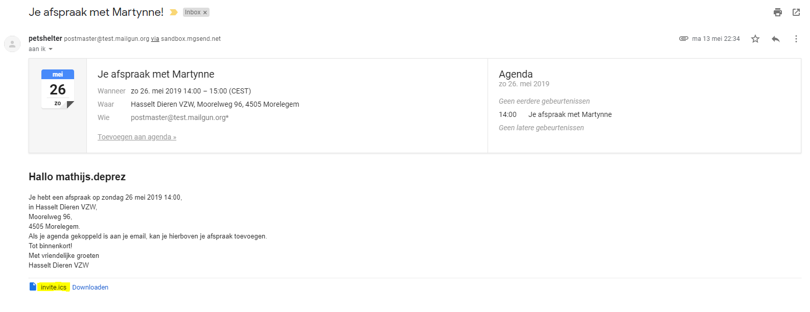
</br>
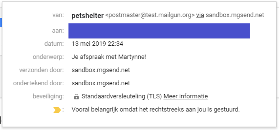

De eigenlijke string die via het ICal formaat als bijlage wordt doorgezonden:

```ics
BEGIN:VCALENDAR
VERSION:2.0
PRODID:-//hacksw/handcal//NONSGML v1.0//EN
BEGIN:VEVENT
UID:uid1@example.com
DTSTAMP:19970714T170000Z
ORGANIZER;CN=John Doe:MAILTO:john.doe@example.com
DTSTART:19970714T170000Z
DTEND:19970715T035959Z
SUMMARY:Bastille Day Party
GEO:48.85299;2.36885
END:VEVENT
END:VCALENDAR
```

De mail die in petshelter wordt verzonden heeft dus een plaintext body, een html body en een ICal attachement.

Deze mail wordt gemaakt behulp van twee tools:

* [MimeKit](http://www.mimekit.net/): een libary die toelaat bestanden van een specifiek MimeType aan te maken.
* [ICal.NET](https://github.com/rianjs/ical.net): een tool die na configuratie in code een ICal string teruggeeft.

Daarna wordt de mail verzonden via de [MailGun API](https://documentation.mailgun.com/en/latest/). Er wordt niet rechtsreeks gecommuniceerd met een SMTP server. Dit omdat een simpele [API call met het mimebestand](https://stackoverflow.com/questions/38840101/how-to-send-a-ical-invite-with-mailgun-rest-api-c) naar de Mailgun service veel performanter is.

Een gewone mail via Mailgun verzenden kan ook veel eenvoudiger, door in plaats van de door MimeKit gegenereerde mail een simpele JSON object op te zenden. Er werd met MimeKit gewerkt omdat ICalendar niet ondersteund wordt via een gewone API call naar Mailgun. Dit is een voorbeeld van een simpele [Mailgun client](https://gist.github.com/duncansmart/3777530), zonder ICalender en met ```HttpClient```.

Via een Mailgun dashboard worden gegevens zoals API key en domain URI aangeleverd.

```cs
public class MailGunHttpClient
{
    private readonly HttpClient _client;
    public MailGunHttpClient(HttpClient client)
    {
        _client = client;
    }
    public async Task<HttpResponseMessage> SendSimpleMessage()
    {
        var form = new Dictionary<string, string>
        {
            ["from"] = "test@testmail.org",
            ["to"] = "test@testmail.com",
            ["subject"] = "Test",
            ["text"] = "testing testing"
        };

        return await _client.PostAsync(
            "messages",
            new FormUrlEncodedContent(form));
    }
}
```

*Noot: domeinen van de gratis versie van Mailgun worden weerhouden door Microsoft Outlook.*

#### Images uploaden en opslaan in SQL Server

Voor de seeddata worden foto's gebruikt van de ["DogApi"](https://docs.thedogapi.com/) en ["CatApi"](https://docs.thecatapi.com/) van Aden Forshaw, "Dogs/Cats As A Service".

Daarnaast moet een volunteer [een foto uploaden om wanneer die een een huisdier post](https://www.c-sharpcorner.com/article/how-should-we-store-images-and-blob-files-in-sql-server/). Langs frontend zijde zijn daarvoor de volgende componenten nodig:

Een input tag als type file:

```html
<b-upload v-model="file" name="file" v-validate="'required'">
    <a class="button is-primary">
        <b-icon pack="fas" icon="upload"></b-icon>
        <span>Klik om een foto te selecteren</span>
    </a>
</b-upload>
```

In de POST event gebeurt het volgende:

```js
// CreatePet.vue
// FormData kan naast gewone inputvelden ook files bevatten.
const formData = new FormData();
// File toevogen
formData.append('image', this.file, this.file.name);
```

Dit object wordt samen met ```axios``` (een soort frontend HttpClient, zie hieronder) verzonden naar de petshelter API. Daar wordt de file geparst naar een ```IFile``` datatype, om vervolgens gestreamd te worden naar een ```byte``` array. Eerst worden de bytes naar een ```Image``` datatype omgezet om de extensie te kunnen bepalen. Als die geldig is worden de bytes met de overige ```Image``` info opgeslaan in SQL Server als binaire data: ```VARBINARY(MAX)```.

Om deze data te zenden naar de frontend, moet dat via JSON. JSON ondersteunt echter geen ```byte[]``` datatype. Daarom moeten de bytes eerst omgezet worden naar een base64 geëncodeerde string. In petshelter gebeurt dit via AutoMapper:

```cs
public PetMapping()
{
    .ForMember(pet => pet.Base64Image,
        opt => opt.MapFrom(src =>
        src.Image != null
            ? $"data:image/{src.Image.ContentType.ToLower()};base64,{Convert.ToBase64String(src.Image.Data)}"
            : null));
}
```

### Client: Vue, Vue plugins en andere NPM pakketten

#### Wat is Vue

Vue.js is een frontend JavaScript framework dat de laatste jaren veel aan populariteit heeft gewonnen. Momenteel heeft de [github](https://github.com/vuejs/) meer dan 130 000 'stars' ontvangen (Angular: 50 000; React: 126 000).

Er is een wildgroei aan JavaScript frameworks. Voorstanders zeggen dat de eenvoud van Vue hier een oplossing voor biedt. Vue blijkt immers voor een beginner minder complex dan Angular or React, de andere populaire JavaScript frameworks. Het wordt vergeleken met een moderne jQuery:

* het is snel & gemakkelijk inzetbaar voor een fraai resultaat,
* templating,
* het brengt HTML, CSS & JavaScript logisch samen,
* geen ingewikkelde dependencies, is schijnbaar direct verbonden aan user interactie,
* build pipelines niet noodzakelijk, dus perfect voor prototypes, of voor legacy apps gedeeltelijk op te lappen.

Maar in tegenstelling tot jQuery, is er geen globale "$" waar een hele library in huist. Vue gebruikt componenten. Gezien deze modulaire aanpak, is het vanaf middelgrote projecten aangewezen om volgende zaken uit het Vue-ecosysteem mee te nemen:

* vue-router: routing & view content
* vuex: state management

Daarnaast zijn de grootste voordelen:

* de geminifiede package is 20 kb transfer, 70 kb runtime: snel 
* reactivity: "magische" detectie in verandering onderliggende data en onmiddellijk resultaat

#### Waarom Vue (of gelijk welk modern JavaScript framework)

##### De HTML Document Object Model

DOM (Document Object Model) operaties zijn kostelijk. De DOM is de HTML-tree en operaties op nodes hebben potentieel veel effecten. Bijvoorbeeld, een marge wijzigen kan invloed hebben op heel wat andere elementen. Daarom gebruikt Vue (e.a.) een 'virtuele' DOM, een lightweight DOM die -heel kort gezegd- de manipulaties op nodes eerst in JavaScript verwerkt, vooraleer te renderen. Op die manier worden veranderingen in onderliggende data efficiënt in de UI getoond.

#### Hoe werkt Vue

##### Installeren

Vanboven : Vue CLI & Vue UI. Echter na enkel een CDN script toe te voegen is het mogelijk direct met Vue te programmeren:

``` html
<!-- html -->
<script src="https://cdn.jsdelivr.net/npm/vue"></script>

### Instantiëren
``` js
//javascript
var app = new Vue({
    el : '#app',
    data : {
        appName = 'pet shelter'
    }
});

```

```el``` is het element waarop de Vue instantie gemount wordt. Deze wordt gedefinieerd aan de hand van het hekje ```#``` en het ```id``` attribuut van het element, een beetje zoals een jQuery selector. Een Vue object op de html of body tag mounten is bad practice.

```data``` is de onderliggende data in de vorm van een JavaScript object. Vue voegt logica toe bij de getter en setter van de properties van dit data object. Wanneer het data object gemanipuleerd  wordt, zorgt Vue ervoor dat dit efficiënt weerspiegeld wordt in de DOM, zonder dat er daar code voor moet geschreven worden. Dit is de "magische" reactiviteit.

*Noot: het is niet mogelijk extra properties at runtime te gaan toevoegen aan het data object, dan zal de reactiviteit niet werken.*

Wat verbindt nu de HTML met dit ```data``` object? Dit gebeurt via de volgende concepten:

##### Tekst interpolatie

Met bovenstaand Vue object kan onderstaande HTML uitgeschreven worden:

``` html
<!-- html -->
<div id ="app">
    <h1> {{appName}} </h1>
</div>
```

Hier wordt de data gebruikt om de inhoud van de ```<h1>``` tag in te vullen. Dit gebeurt aan de hand van dubbele accolades: ```{{appName}}```.

##### Directives

```js
//javascript
var app2 = new Vue({
    el: '#app2',
    data : {
        msg : 'Hello Panta Rhei!',
        hooverText : 'Dit is een voorbeeldtekst.'
    }
});
```

```html
<!-- html -->
<div id="app2">
    <div v-bind:title="hooverText"> {{ msg }} </div>
</div>
```

*Noot: een ```title``` attribuut bepaalt de tekst die verschijnt na over een element te hooveren.*

Hier is de ```v-bind``` attribuut iets nieuws. Dit is een "directive". Directives hebben een "v-" prefix en voorzien verscheidene logica, in dit geval reactief gedrag (reactive behavior). Bovenstaande code zegt: het ```title``` attribuut moet geüpdatet worden wanneer ```hooverText``` van waarde wijzigt. Via de F12 console wordt het volgende command uitgevoerd: 

``` js
//F12 Browser Console
app2.$data.hooverText = 'dit is nu de hoovertekst!';
```

Daarna verandert het attribuut onmiddellijk van waarde. Overigens, voor Vue is het volgende exact hetzelfde als bovenstaande code:

``` js
//F12 Browser Console
app2.hooverText = 'dit is nu de hoovertekst!';
```

##### Conditionaliteit

Directives kunnen ingezet worden om voorwaardelijke logica te gebruiken:

``` html
<!-- html -->
<div id="app3">
  <span v-if="visible">Nu zie je me</span>
</div>
```

``` js
//javascript
var app3 = new Vue({
  el: '#app3',
  data: {
    visible: true
  }
});
```

Wanneer in de console ```app3.visible = false;``` ingevoerd wordt, dan verdwijnt "Nu zie je me" tekst.

##### Loops

Een array van waarden wordt gerenderd via een ```v-for``` directive.

``` js
//javascript
var app4 = new Vue({
    el: '#app4',
    data: {
        pets : [{
                name: 'Fons',
                type: 'Cat'
            },{
                name: 'Mops',
                type: 'Dog'
            },{
                name: 'Toby',
                type: 'Flamingo'
            }]
    }
});
```

``` html
<!-- html -->
<div id="app4">
    <ul>
        <li v-for="pet in pets">
            {{ pet.name}} is een {{pet.type}}!
        </li>
    </ul>
</div>
```

Dankzij de ```v-for``` directive worden  ```<li>``` elementen gerenderd voor elke object in de array. Het ```in``` keyword is ondersteund in de directive.

##### Events

```js
// javascript
var app5 = new Vue({
    el: 'app5',
    data :{
        clickCounter : 0
    },
    methods :{
        incrementCounter : function(){
            this.clickCounter++;
        }
    }
});
```

Er zijn hier twee nieuwe zaken:

* ```methods``` object: hier worden functies (event handlers) bewaard
* ```this``` keyword: een shortcut voor het data object.

```html
<!-- html -->
<div id="app5">
    <div> Er is al {{clickCounter}} keer geklikt. </div>
    <button v-on:click="incrementCounter"> </div>
</div>
```

Hier is de ```v-on``` een directive die bij het ```click``` event de eventhandler ```raiseCounter()``` methode zal uitvoeren.

Het is mogelijk de inhoud van de functie rechtsreeks te injecteren:

```html
<!-- html -->
<div id="app5">
    <div> Er is al {{clickCounter}} keer geklikt. </div>
    <button v-on:click="clickCounter++"> </div>
</div>
```

##### Componenten

Hierboven staat er telkens ```app-x``` als Vue object en wat HTML ernaast. Het is de bedoeling dat die JavaScript en HTML *template* samen gebruikt worden, dit is een component. Een webpagina, (zeker in het geval van Single Page Applications), bestaat uit heel wat, vaak herbruikbare, componenten. Zo is er een navigatiebar, tabel, etc...

Dit is een implementatie van "Custom Element", een onderdeel van het [Web Component Spec](https://www.webcomponents.org/specs). Elke custom tag (bijvoorbeeld ```app-content```) is een Vue object (component) met daarin een HTML template en JavaScript logica.

Bijvoorbeeld: elke node in onderstaande structuur is een Vue component.

```
app (hoofd)
│   navigatie
│
└───sidebar
│   │   headline-lijst
│   │   spotlight-pet-artikel
│
└───pets-slideshow
│   │
│   └───pets-data-access
│   │   │   (extern component)
│   │
│   └───slideshow-component
│       │   (extern component)
```

Vue maakt het mogelijk dit als volgt de definiëren in HTML:

```html
<!-- html -->
<html>
    <body>
        <div id="app">
            <app-nav></app-nav>
            <app-sidebar>
                <app-headlines></app-headlines>
                <app-pet-spotlight></app-pet-spotlight>
            </app-sidebar>
            <app-slideshow></app-slideshow>
        </div>
    </body>
</html>
```

Dit is een implementatie van "Custom Element", een onderdeel van het Web Component Spec. Elke custom tag (bijvoorbeeld ```app-content```) is een Vue object (component) met daarin een HTML template en JavaScript logica.

Een voorbeeld van zo'n component in .vue formaat (te gebruiken na project creatie met Vue CLI of UI)

```html
<!-- app.vue -->
<template>
    <div id="app">
        
        <!-- Hier wordt een component binnenin dit component gebruikt -->
        <HelloWorld msg="Welcome to Your Vue.js App" />
    </div>
</template>

<script>
    // Hier wordt een component geïmporteerd - vergelijk dit met "using" in C#
    // Nu kunnen we dit component gebruiken in de HTML template
    import HelloWorld from './components/HelloWorld.vue'

    // Hier wordt de module (d.i. het Vue object) geëxporteerd.
    // In index.html wordt de component <app> </app> gebruikt.
    export default {
        name: 'app',
        // hier wordt het component geregistreerd
        components: {
            HelloWorld 
        }
    }
</script>
```

De componenten worden met [ES2015 modules](https://hacks.mozilla.org/2015/08/es6-in-depth-modules/) geschreven. Per component zijn er drie onderdelen: ```<template>```, ```<script>```, en optioneel ```<style>```, die kan beperkt worden tot het huidig component m.b.v. ```<style scoped>```. Samen wordt dit component in het begin van de lifecycle gecompiled (zie hieronder).

De petshelterClient wordt volgens deze componenttree opgemaakt:

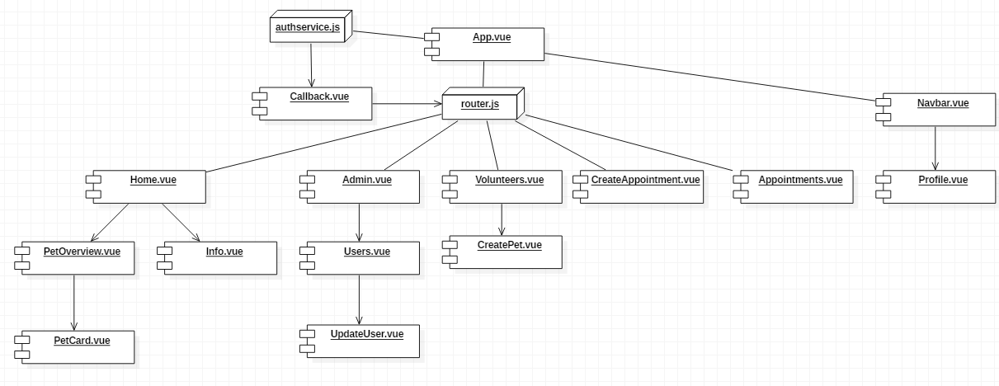

##### axios

In de uitleg wordt er vaak "data gevraagd aan de petshelterAPI". Dit gebeurt via [axios](https://github.com/axios/axios). Axios initieert RESTful en async HTTP requests. Een configuratie object met o.a. ```params``` en ```headers``` kan meegegeven worden.

##### Lifecycle events

Elk vue component heeft een lifecycle. In die lifecycles zijn er verschillende fases. Per fase zijn worden er twee events geraised: één voor de fase, en één erna. Dit gaat als volgt:

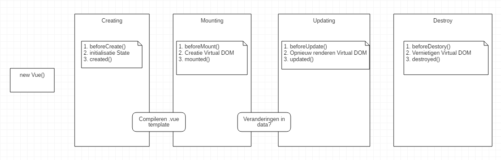

In petshelterClient wordt gebruik gemaakt van events. Terwijl het component op de Virtual DOM gemount wordt, wordt via de ```mounted()``` event data opgehaald uit petshelterAPI.

```js
//CreatePet.vue
export default{
    data(){
        return {
            categories: null,
            colors: null,
            genders: null
        }
    },
    async mounted() {
        const accessToken = await
            this.$auth.getAccessToken();

        const { data } = await
            this.$http.get(`${this.$auth.audience}/api/pets/create`, {

            headers: {
                Authorization: `Bearer ${accessToken}`
            }

        });

        this.categories = data.value.categories;
        this.colors = data.value.colors;
        this.genders = data.value.genders;
    }
}
```

##### Buefy (Bulma + Vue)

Voor styling gebruikt petshelter Buefy (https://buefy.org/documentation/). Dit is een libary die Vue componenten combineert met [Bulma](https://bulma.io/documentation/). Bulma is een CSS framework zoals Bootstrap. Bulma heeft wel als verschil dat het uitsluitend uit CSS code bestaat, en geen JavaScript.

Dus met Buefy beschikt men over het volledige CSS framework van Bulma, gecombineerd met enkel Vue componenten, waar wat voorgebouwde JavaScript wel handig is. petshelterClient gebruikt volgende Buefy componenten:

* forms: fields, input, calendar, select, uploadbutton
* table
* button
* card

Uiteraard is het mogelijk dergelijke componenten zelf te creëren. Bijvoorbeeld, bij het maken van een afspraak levert de API reeds alle tijdstippen waarop een afspraak mogelijk is. Deze data wordt in de form voorgesteld als knoppen die via [flexbox](https://css-tricks.com/snippets/css/a-guide-to-flexbox/) onder elkaar staan.

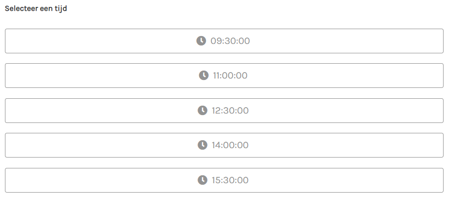

Voor alle overige zaken zoals Navbar, layout, helpers, [SCSS](https://sass-lang.com/) mixins... wordt Bulma zelf gebruikt.

##### vue-router

[Vue router](https://router.vuejs.org/) is een router API, die routing heel wat eenvoudiger maakt. In ```App.vue``` & ```Navbar.vue``` wordt ```router.js``` als volgt gebruikt:

In ```App.vue``` staat er een ```<router-view> </router-view>```.

```js
// App.vue
<template>
    <div>
        <Navbar></Navbar>
        <div class="has-navbar-fixed-top">
            <router-view></router-view>
        </div>
    </div>
</template>
```

Wanneer op een ```<router-link></router-link>``` geklikt wordt, gaat ```router.js``` de ```<router-view> </router-view>``` opvullen.

```html
<!-- Navbar.vue -->
<div class="navbar">
    <router-link to="/" class="navbar-item">Home</router-link>
    <router-link to="/Volunteers" class="navbar-item">Nieuw huisdier</router-link>
</div>
```

Die router is gedefinieerd in ```router.js```, maar is binnen elk Vue component beschikbaar via ```this.$router```.

```js
//router.js
import Vue from 'vue';
import Router from 'vue-router';

// hier worden de componenten geïmporteerd die
// de router pusht naar <router-view>
import Home from './components/Home.vue';
import Volunteers from './components/Volunteers.vue'

Vue.use(Router);

const routes = [
    {
        path: '/',
        name: 'home',
        component: Home
    },
    {
        path: '/volunteers',
        name: 'volunteers',
        component: Volunteers
    }
    // ...
];

const router = new Router({
    mode: 'history',
    base: process.env.BASE_URL,
    routes
});
export default router;
```

##### Communicatie

Communicatie tussen componenten kan complex worden. In petshelter is er in de Admin view een component met een tabel gevuld met users. Als er op een entry geklikt wordt, verschijnt ernaast een detail getoond van die geselecteerde user, ```selectedUser```.

Het detail wordt gezien als een child component van de overview component. Daarom moeten het component eerst geïmporteerd, en dan geregistreerd zijn in het ```Users.vue``` component.

```js
//Users.vue

// het component wordt geïmporteerd
import UpdateUser from '../components/UpdateUser.vue';

export default {
    name: 'Users',
    data() {
        return {
            selectedUser: null
        }
    },
    // het component wordt geregistreerd
    components: {
        UpdateUser
    }
}
```

In het template gedeelte wordt het component geplaatst.

```html
<div class="container">
    <div class="columns">
        <div class="column">
            <!-- we gebruiken het geregistreerde UpdateUser component -->
            <UpdateUser
                v-bind="selectedUser">
            </UpdateUser>
        </div>
    </div>
</div>
```

Merk op dat hier het ```v-bind``` attribuut toevoegd is. In dit geval, de ```selectedUser```. Gezien de reactieve eigenschap van de ```selectedUser``` wordt het child component ```UpdateUser.vue``` opgevuld met de user data. Deze properties van user, ```props```,  worden als volgt gedefinieerd in ```UpdateUser.vue```.

```js
// UpdateUser.cs
 export default {
    name: 'UpdateUser',

    // de properties van een User
    // De user entries uit de data van de parent hebben dezelfde properties

    props: {
        id: String,
        email: String,
        username: String,
        shelterId: Number,
        shelterName: String,
        roles: Array
    }
}
```

Naast het datatype (```String```, ```function```...), kunnen ook nog andere attributen toegevoegd worden zoals ```required``` e.d.

Met ```props``` kan dus communicatie geconfigureerd worden tussen parent-child.

In het child component kan een user geüpdatet worden. Dan is het mooi dat ook de tabel uit het parent ook geüpdatet wordt. Dus is ook child-parent communicatie nodig. Een child component kan zijn parent rechtsreeks aanspreken via ```this.$parent```, maar dit wordt afgeraden. Het is beter om events te gebruiken:

* er is controle over hoe ver omhoog events gaan in de component tree,
* het zorgt voor meer onderhoudbare code.

In het child component wordt de user geüpdatet in de ```OnSubmit()``` functie. Wanneer de API een OK statuscode teruggeeft, wordt er een event geëmit met de naam ```'userUpdated'```:

```js
// child UpdateUser.vue
async onSubmit() {

    // we posten hier de data...

    // indien succesvol
    if (response.status === 200) {

        // Via emit Vue API die kan aangesproken worden binnen een Vue component,
        // wordt er via deze code een event geëmit
        this.$emit('userUpdated', this.id);
    } else {
        console.log('something went wrong');
    }
}
```

In het parent component wordt er geluisterd naar dit event via het [observerpatroon](https://nl.wikipedia.org/wiki/Observer_(ontwerppatroon)).

```html
<!-- parent Users.vue -->
<UpdateUser
    v-bind="selectedUser"
    @userUpdated="getUsers">
</UpdateUser>
```

```getUsers()``` is een functie die opnieuw de onderliggende data gaat gaan ophalen die in de users tabel getoond wordt.

### Authenticatie en autorisatie

Authenticatie en autorisatie is moeilijk te documenteren, gezien het enerzijds in verschillende lagen van de stack moet geïmplementeerd worden. Anderzijds is het sowieso een ingewikkelde materie waar men best geen fouten maakt.

petshelter maakt gebruik van Auth0 services. Auth0 biedt een compleet platform aan om users te beheren.

Om te starten met Auth0 moet er een "tenant" aangemaakt worden. Deze wordt geïdentificeerd met een domain. Op deze tenant zit alle authenticatie configuratie: users, roles, rules...

Ook mogelijke Idenity providers zijn te configureren. Naast Auth0 zelf, is voor petshelter Google als mogelijke Identity provider geconfigureerd.

Naast al die zaken, kunnen bestaande applicaties toegevoegd worden via het Auth0 dashboard.

Bij het registreren van een applicatie krijgt de applicatie een ClientId en ClientSecret toegewezen van Auth0. Met deze gegevens kunnen bijvoorbeeld users inloggen, of kan de API credentials aanvragen voor toegang tot de Auth0 userstore. Zowel de petshelterClient als petshelterAPI zijn geregistreerd bij Auth0. petshelterClient krijgt geen ClientSecret: gezien de publieke aard van Single Page Applications mogen zij die niet bijhouden.

Applicaties loggen als het ware aan bij de tenant met ClientId en ClientSecret, terwijl users aanloggen bij de tenant met hun mail en wachtwoord.

Alles is te configureren via het Auth0 Dashboard. Een andere mogelijkheid is de Auth0 Management API, die aangesproken wordt binnen petshelterApi via ```HttpClient```.

#### Voeg claims (en dus rollen) toe aan tokens

Ergens in de authenticatie pipeline van Auth0 kunnen regels toevoegd worden in JavaScript. Hieronder zie een "Rule" waar er claims worden toegevoegd op basis van data van de userstore van Auth0.

Deze rule wordt toegevoegd in het "Rules" gedeelte van het Auth0 Dashboard.

```js
// auth0 rule in JavaScript
function (user, context, callback) {

    // Claims enkel aan geverifieerde users toewijzen
    if (!user.email || !user.email_verified) {
        return callback(null, user, context);
    }

    user.app_metadata = user.app_metadata || {};

    auth0.users.updateAppMetadata(user.user_id, user.app_metadata)
        .then(function () {

            // Een rol claim wordt toegevoegd
            // die we halen uit de Auth0 datastore user,
            // wordt eerst toegevoegd aan de access token (API),
            // en dan aan de id token (SPA)
            context.accessToken['http://schemas.microsoft.com/.../claims/role'] =
                user.app_metadata.roles;

            context.idToken['http://schemas.microsoft.com/.../claims/role'] =
                user.app_metadata.roles;

            // Een shelter claim wordt toegevoegd
            // die we halen uit de Auth0 datastore user,
            // wordt eerst toegevoegd aan de access token (API),
            // en dan aan de id token (SPA)
            context.accessToken['http://schemas.petshelter.org/identity/claims/shelter'] =
                user.app_metadata.shelter;

            context.idToken['http://schemas.petshelter.org/identity/claims/shelter'] =
                user.app_metadata.shelter;

            callback(null, user, context);
        })
        .catch(function (err) {
            callback(err);
        });
}
```

#### Client configuratie

Er werd reeds vermeld dat een Single Page Application niet met een ClientSecret kan vertrouwd worden. Daarom moet die, in tegenstelling tot een webapp met bijvoorbeeld Razor, geen ClientSecret opgeven. Het volstaat om een ```authservice.js``` te definiëren. Deze service bevat, dankzij het importeren van een ```auth0-js``` package, methods zoals ```login()```, ```getAccessToken()```...

Wanneer een user inlogt via petshelterClient, wordt die verbonden met de Auth0 Authorization API. In ruil voor emailadres en wachtwoord, en de configuratie die meegegeven is door Auth0 (ClientId en domein URI) wordt er een [JSON Web Token](https://jwt.io/) verkregen.

Om met een SPA in-en uit te loggen, en dus connecteren met de Auth0 Authorisation API, kan er gebruik gemaakt worden van de Implict Grant. Gedetailleerde uitleg [hier](https://auth0.com/docs/flows/guides/implicit/call-api-implicit#response). Kort gezegd wil het zeggen dat wanneer de pagina gerefresht wordt, er opnieuw moet ingelogd worden. Dit gebeurt echter heel vlot door middel van een JSON Web Token. De user hoeft dus niet telkens opnieuw in en uit te loggen (en email + wachtwoord opgeven).

Deze JSON Web Token bevat een ```userId``` en een ```accessId```. De ```userId``` wordt gebruikt door de SPA om onder ander front end autorisatie toe te passen. Zo kan de ```authservice.js``` aangesproken worden in het ```Navbar.vue``` component om te controleren of de user de rol "volunteer" heeft, en al dan niet een link tonen. Een JSON Web Token is geëncrypteerd, tamperproof en heeft een time to live.

De ```accessId``` wordt meegezonden met requests naar de petshelterAPI. Als de API de request accepteert, controleert die of er een correcte ```accessId``` in de headers zit.

#### API configuratie

De API moet deze JSON Web Token Access Id dus kunnen parsen, en daarnaast ook kunnen omgaan met de encryptie en security. Dit gebeurt via configuratie in de ```Startup.cs```.

```cs
public void ConfigureServices(IServiceCollection services)
{
    // De Authenticatie services toevoegen: JWT parsers configureren
    string domain = $"https://{Configuration["Auth0:Domain"]}/";
    services.AddAuthentication(options =>
    {
        options.DefaultAuthenticateScheme =
            JwtBearerDefaults.AuthenticationScheme;

        options.DefaultChallengeScheme =
            JwtBearerDefaults.AuthenticationScheme;

    }).AddJwtBearer(options =>
    {
        options.Authority = domain;
        options.Audience = Configuration["Auth0:ApiIdentifier"];
    });

}

public void Configure(IApplicationBuilder app, IHostingEnvironment env)
{
    // Authenticatie middleware activeren
    app.UseAuthentication();
}
```

Na deze configuratie is het mogelijk authenticatie en autorisatie schema's, attributen, beheer... te gaan opzetten in de API, zoals bijvoorbeeld:

```cs
//controller.cs
[HttpPost]
[Route("create")]

// de geparste access token wordt hier gecontroleerd
// of het de claim "role volunteer" heeft
[Authorize(Roles = "volunteer, admin")]
public async Task<IActionResult> Create([FromForm]CreatePet.Command pet)
{
    var result = await _mediator.Send(pet);
    return StatusCode((int)result.StatusCode, result.StatusText);
}
```

Om voor admin activiteiten userinformatie op te vragen, is er toegang nodig tot de Auth0 userstore. Dit gebeurt wel via een protocol waarbij een *Auth0 API* access token moet verkregen worden. Deze access token is niet gelijk aan die geparst uit de JWT. In petshelter wordt er rechstreeks in de configuratie file een development access token geïnjecteerd. Dit is niet mogelijk in productie.

Deze Auth0Api Token wordt [verkregen in ruil voor ClientSecret & ClientId](https://auth0.com/docs/flows/concepts/client-credentials) van de API.

```cs
//Startup.cs
services.AddHttpClient<IAuth0ApiClient, Auth0ApiClient>(client =>
{
    client.BaseAddress = new Uri(Configuration["Auth0:ManagementDomain"]);
    client.DefaultRequestHeaders.Add(
        "authorization",
        Configuration["Auth0:ManagementToken"]);
    client.DefaultRequestHeaders.Accept.Add(
        new MediaTypeWithQualityHeaderValue("application/json"));
});
```

De Auth0 Management API kan niet rechtsreeks aangesproken worden door de SPA client: gezien er daar geen overdracht kan gebeuren van ClientSecret.

##### Resource based authorization

Naast rollen en claims, is er soms data nodig die men niet terugvindt in de accesstoken. Bijvoorbeeld, wanneer een user zich inlogt op petshelter, geeft de authenticatie niet terug welke afspraken hij heeft. Dus wanneer er een DELETE HTTP method vertrekt vanuit petshelterClient, die vraagt om een afspraak te verwijderen, moet de database eerst kunnen verifiëren of de ```userID``` uit de accesstoken overeenkomt met de ```UserID``` van het ```Appointment``` model. Als niet aan voorwaarde niet wordt voldaan, geeft de controller een ```Forbid()``` terug. Hiervoor kan men [Resource based authorization](https://docs.microsoft.com/en-us/aspnet/core/security/authorization/resourcebased?view=aspnetcore-2.1&tabs=aspnetcore2x) inzetten.

Hiervoor wordt er een implementatie van de ```IAuthorizationService``` geregistreerd bij ```Startup.cs``` en geïnjecteerd in ```AppointmentController```.

```cs
// Startup.cs
services.AddSingleton<IAuthorizationHandler, AppointmentAuthorizationCrudHandler>();
```

```cs
// AppointmentsController.cs
private readonly IAuthorizationService _authorizationService;

public AppointmentsController(IAuthorizationService authorizationService)
{
    _authorizationService = authorizationService;
}

[HttpDelete]
[Route("delete/{appointmentId}")]
[Authorize]
public async Task<IActionResult> Delete(int appointmentId)
{
    var appointment = _petShelterDbContext
                        .Appointments
                        .FirstOrDefault(x => x.Id == appointmentId);
    if (appointment == null)
    {
        return NoContent();
    }

    /* implementatie van AuthorizeAsync callen
    met een appointment en de requirement Delete */

    var authResult = await _authorizationService
            .AuthorizeAsync(User,appointment, Operations.Delete);

    if (!authResult.Succeeded)
    {
        // HTTP Statuscode 403: geen autorisatie
        return Forbid();
    }

    _petShelterDbContext.Remove(appointment);
    await _petShelterDbContext.SaveChangesAsync();
    return NoContent();
}
```

Daarna wordt de opgevraagde resource vergeleken met de userclaims:

```cs
/* Implementatie abstracte klasse AuthorizationHandler,
die overerft van de IAuthorizationHandler interface */

public class AppointmentAuthorizationCrudHandler : AuthorizationHandler<OperationAuthorizationRequirement, Appointment>
{
    protected override Task HandleRequirementAsync(
        AuthorizationHandlerContext context,
        OperationAuthorizationRequirement requirement,
        Appointment resource)
    {
        /* zijn de claims gelijk aan
        de UserId van de resource 
        die de frontend SPA zojuist heeft opgevraagd? */

        var userId = context.User.Claims
            .FirstOrDefault(x => x.Type == ClaimTypes.NameIdentifier)?.Value;

        if (userId == resource.UserId &&
            requirement.Name == Operations.Delete.Name)
        {
            context.Succeed(requirement);
        }

        return Task.CompletedTask;
    }
}
```

### Tools

* [Visual Studio 2017](https://visualstudio.microsoft.com/downloads/)
* [Visual Studio Code](https://visualstudio.microsoft.com/downloads/)
* [ConEmu console](https://conemu.github.io/)
* [Azure Data Studio](https://azure.microsoft.com/nl-nl/updates/azure-data-studio-is-now-available/)
* [github](https://github.com/CleorgeGooney/petshelter)
* [StarUML](http://staruml.io/)
* [Markdown](https://github.com/adam-p/markdown-here/wiki/Markdown-Cheatsheet)
* [Inkscape](https://inkscape.org/)

## Bronnen

### Vue & Frontend

* https://www.npmjs.com/get-npm
* Pluralsight, Vue.js: Big Picture, Daniel Stern
* Pluralsight, Vue.js: Getting Started, Chad Campbell
* https://vuejs.org/v2/guide/index.html
* https://vuejs.org/v2/cookbook/
* https://medium.com/js-dojo/whats-the-deal-with-vue-s-virtual-dom-3ed4fc0dbb20
* https://github.com/vuejs/awesome-vue
* https://router.vuejs.org/
* https://vuex.vuejs.org/
* https://github.com/axios/axios
* https://hacks.mozilla.org/2015/08/es6-in-depth-modules/
* https://buefy.org/documentation/
* https://bulma.io/documentation/
* https://sass-lang.com/
* https://webpack.js.org/ 
* https://css-tricks.com/snippets/css/a-guide-to-flexbox/
* https://www.webcomponents.org/specs

### ASP.NET

* https://docs.microsoft.com/en-us/dotnet/core/tools/dotnet-run?tabs=netcore21
* https://dotnet.microsoft.com/download/dotnet-core/2.2
* https://docs.microsoft.com/en-us/aspnet/core/tutorials/first-mvc-app/?view=aspnetcore-2.2
* https://docs.microsoft.com/en-us/aspnet/core/fundamentals/dependency-injection?view=aspnetcore-2.2
* https://docs.microsoft.com/en-us/ef/core/
* https://docs.microsoft.com/en-us/dotnet/framework/data/adonet/ef/language-reference/query-execution
* https://docs.microsoft.com/en-us/aspnet/core/security/authorization/roles?view=aspnetcore-2.2
* https://docs.microsoft.com/en-us/aspnet/core/security/authorization/claims?view=aspnetcore-2.2
* http://docs.automapper.org/en/stable/Getting-started.html
* https://medium.com/volosoft/asp-net-core-dependency-injection-best-practices-tips-tricks-c6e9c67f9d96
* https://dotnetcoretutorials.com/2018/05/03/httpclient-factories-in-net-core-2-1/
* https://docs.microsoft.com/en-us/dotnet/csharp/tutorials/console-webapiclient
* https://www.newtonsoft.com/json/help/html/SerializingJSON.htm

### CQRS

* https://martinfowler.com/bliki/CQRS.html
* https://docs.microsoft.com/en-us/azure/architecture/patterns/cqrs
* https://dapper-tutorial.net/
* https://github.com/jbogard/MediatR
* https://blogs.msdn.microsoft.com/cdndevs/2016/01/26/simplifying-development-and-separating-concerns-with-mediatr/
* https://lostechies.com/jimmybogard/2015/05/05/cqrs-with-mediatr-and-automapper/
* https://jonhilton.net/2016/06/06/simplify-your-controllers-with-the-command-pattern-and-mediatr/

### Threads

* https://docs.microsoft.com/en-us/dotnet/csharp/programming-guide/concepts/async/
* https://docs.microsoft.com/en-us/aspnet/core/fundamentals/host/hosted-services?view=aspnetcore-2.2
* https://docs.microsoft.com/en-us/dotnet/standard/microservices-architecture/multi-container-microservice-net-applications/background-tasks-with-ihostedservice

### Mails

* https://www.ietf.org/rfc/rfc5545.txt
* http://www.mimekit.net/
* https://github.com/rianjs/ical.net
* https://stackoverflow.com/questions/38840101/how-to-send-a-ical-invite-with-mailgun-rest-api-c
* https://gist.github.com/duncansmart/3777530
* https://app.mailgun.com/sessions/new
* https://documentation.mailgun.com/en/latest/

### Images

* https://docs.thedogapi.com/
* https://docs.thecatapi.com/
* https://www.c-sharpcorner.com/article/how-should-we-store-images-and-blob-files-in-sql-server/
* https://docs.microsoft.com/en-us/aspnet/core/mvc/models/file-uploads?view=aspnetcore-2.2

### Authenticatie
* https://auth0.com/docs/
* https://auth0.com/docs/architecture-scenarios/spa-api
* https://auth0.com/docs/quickstart/spa/vuejs/03-calling-an-api#call-the-api-using-an-access-token
* https://auth0.com/docs/api-auth/tutorials/adoption/scope-custom-claims
* https://auth0.com/docs/flows/guides/implicit/call-api-implicit#response
* https://jwt.io/
* https://auth0.com/docs/flows/concepts/client-credentials
* https://docs.microsoft.com/en-us/aspnet/core/security/authorization/resourcebased?view=aspnetcore-2.1&tabs=aspnetcore2x
* http://rion.io/2016/01/04/accessing-identity-info-using-dependency-injection-in-net-5/

### Tools

* https://blogs.msdn.microsoft.com/benjaminperkins/2017/04/04/setting-up-and-using-github-in-visual-studio-2017/
* https://visualstudio.microsoft.com/downloads/
* https://visualstudio.microsoft.com/downloads/
* https://conemu.github.io/
* https://azure.microsoft.com/nl-nl/updates/azure-data-studio-is-now-available/
* https://github.com/CleorgeGooney/petshelter
* http://staruml.io/
* https://github.com/adam-p/markdown-here/wiki/Markdown-Cheatsheet
* https://inkscape.org/
